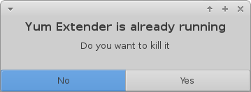

================
Yum Extender FAQ
================

Generel
=============

What does the package colors mean
~~~~~~~~~~~~~~~~~~~~~~~~~~~~~~~~~~
* **red** is an available update
* **green** is an installed package
* **blue** is an obsoleting package (a package replacing one/more packages)
* **black** is an available package in a repository.

This is the default colors, they can be configured in the preferences.

How to select all updates
~~~~~~~~~~~~~~~~~~~~~~~~~~

Click on the **+** in the header column to select/deselect all updates

Configuration
=============

How do it setup yumex, to not ask for password on start
~~~~~~~~~~~~~~~~~~~~~~~~~~~~~~~~~~~~~~~~~~~~~~~~~~~~~~~~~~~~

run the follow as root, to create a PolicyKit rule to run DnfSystem dbus commands without asking for password

::

    cat <<- EOF > /usr/share/polkit-1/rules.d/dnfdaemon-user.rules
    polkit.addRule(function(action, subject) {
        if (action.id == "org.baseurl.DnfSystem" &&
            subject.active == true && subject.local == true &&
            subject.user == "USERNAME") {
                polkit.log(subject.user+" got access to run org.baseurl.DnfSystem");
                return polkit.Result.YES;
        }
    });
    EOF

Replace **USERNAME** with your login username

.. warning:: This will also make other applications using the DnfSystem daemon run without asking for password when running as **USERNAME**

Troubleshooting
=================

Yum Extender is already running
~~~~~~~~~~~~~~~~~~~~~~~~~~~~~~~~

Yum Extender crashed and when you start it again, you get a dialog with the **Yum Extender is already running** message

If you press **No** then the already running Yum Extender window will be shown.
If you press **Yes** then the already running Yum Extender window will closed, if possible.

Yum Extender uses 2 background dbus services, a notification icon service (look for a shield icon in you notification area) and DnfSystem services that is doing
all the dnf related actions. If the gui is crashing, it might not be able to do a clean shutdown of these services.
To clean up open a terminal windows and write the following command.

::
    
    yumex-dnf --exit

It will try to shutdown these services and you should be able to start Yum Extender again.

Debug issues in Yum Extender
~~~~~~~~~~~~~~~~~~~~~~~~~~~~~~~~

If you want to debug a problem in Yum Extender do the following.

1. Open a terminal windows
2. run : **sudo /usr/share/dnfdaemon/dnfdaemon-system -v -d --notimeout**
3. Open another terminal window
4. run : **yumex-dnf -d**

Now you will be able to see Tracebacks and debug information in the 2 windows

You can open an issue here_ for any problem found

.. _here: https://github.com/timlau/yumex-dnf/issues

