==========================================
Yum Extender (yumex-dnf) Documentation
==========================================

Introduction
=============

Yum Extender (yumex-dnf) is a graphical software manager to control the software packages on your system.

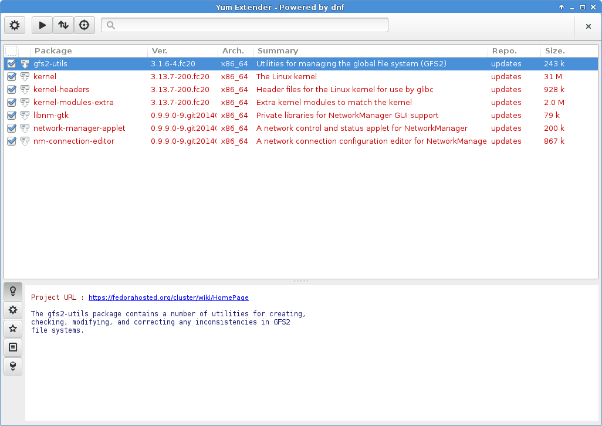

Links
------
* Yum Extender Homepage_
* Yum Extender Development_

.. _Homepage: http://yumex.dk
.. _Development: https://github.com/timlau/yumex-dnf

Usage
======

Main menu
----------
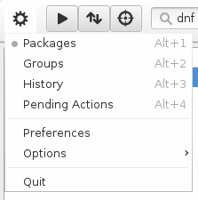

   
The main menu used to select the different views available in Yum Extender.
and other actions like preferences and options.

Views
======
Yum Extender contains 4 different views to show different things like packages, groups, history & pending package actions.

Packages View
--------------
This view is used for normal package operations like browser or search for packages and add packages to the pending action queue
to be installed, upgraded or removed.

This is a overview of the Yum Extender header bar in the package views

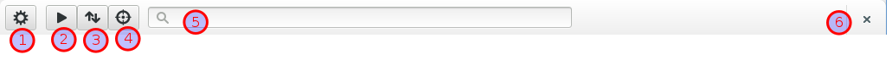

1. The main menu 
2. Apply pending actions
3. Filter menu
4. Search option menu
5. Search entry
6. Quit Yum Extender

Filter menu
~~~~~~~~~~~~
The filter menu is used to limit the packages show to a special kind of status, this can 

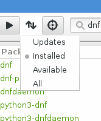

1. **updates** will show available updates for installed packages
2. **installed** will show packages installed on the local system
3. **available** will show packages available in the active repositories, there is not installed on the local system
4. **all** will show all of the above packages.

There filters applies both to the current search result or all packages if no seach is performed.

**available** and **all** will can take very long time, if used not limited by a search.

Search Option Menu
~~~~~~~~~~~~~~~~~~~
The search option menu is used to specify what type of search is performed when something is entered in
the search entry.

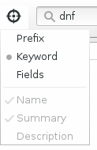

There is 3 kind of available search types:

1. **prefix** is searching for package names there is starting with the keyword in the search entry.
2. **keyword** is searching for package names there contains the keyword from the search entry.
3. **fields** is searching for packages where packages attributes like name, summary or description is containing the keywords from the search entry

Searching
~~~~~~~~~~
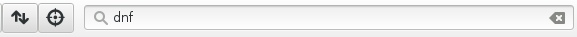

Searching is performed by entering a keyword in the search entry and pressing **Enter**

If a new search is performed then all search results will be shown, but can be filtered for package states, using
the filter menu |filters|.

Package selection
~~~~~~~~~~~~~~~~~
To perform action on packages in the view, you have to click on the checkbox in the selection column
then checked, the package is add to the pending action queue, then action performed on the package depends
on the current installation state of the selected package.

* An installed package will be queued for removal
* An available package will be queued for installation.
* An available update will be queued for update.

The selection column header can be uses to perform actions on all shown packages in the view.

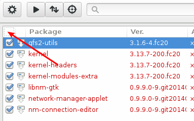

clicking on the column header will switch between there states

* Select all shown packages
* Unselect all shown packages
* Redo single selections by user

Groups View
--------------
The group view is selected from the main menu |main-menu|

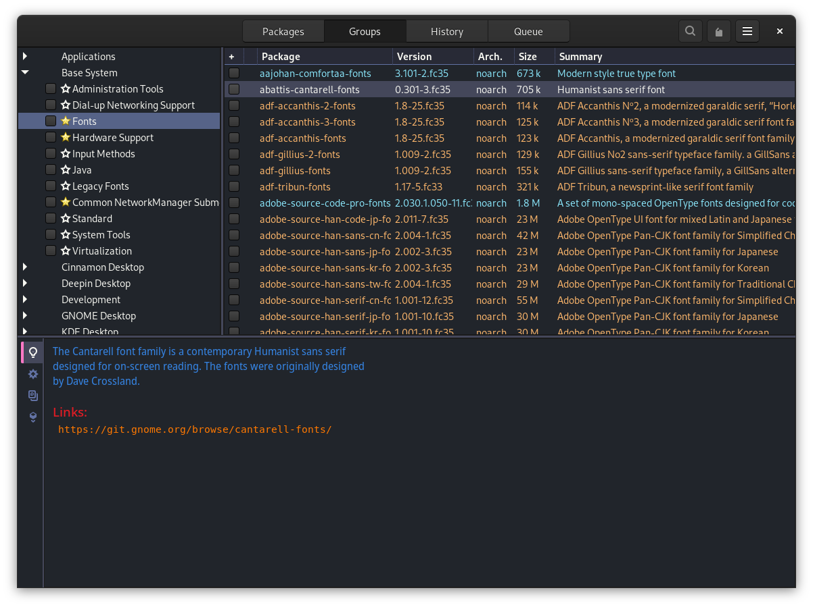

History View
--------------
The history view is selected from the main menu |main-menu|

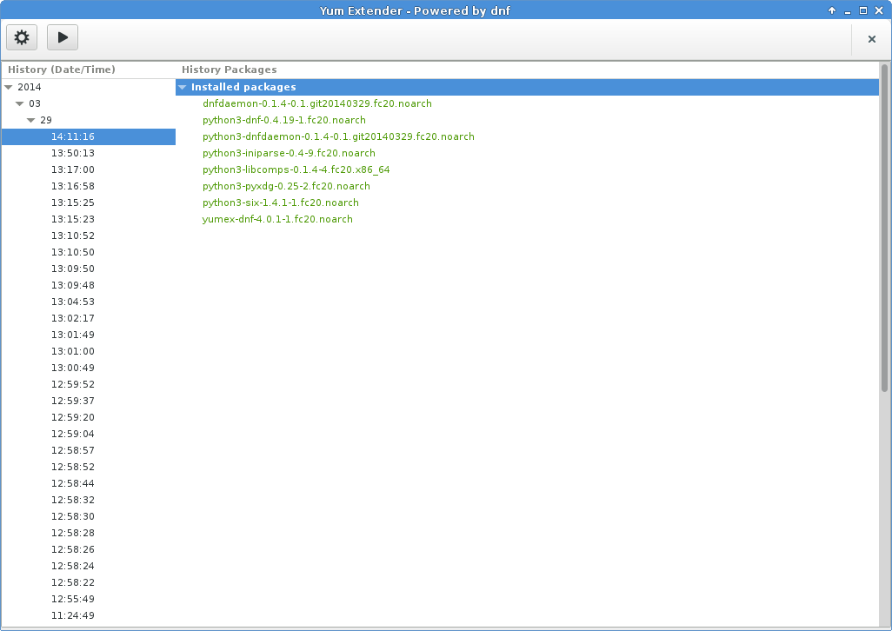

Pending Actions View
--------------------------
The pending action view is selected from the main menu |main-menu|

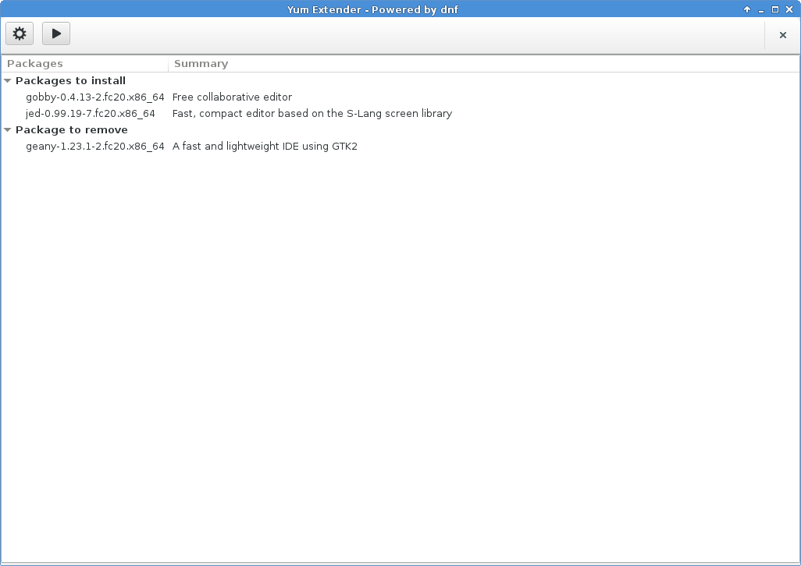
   

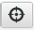
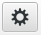
   

